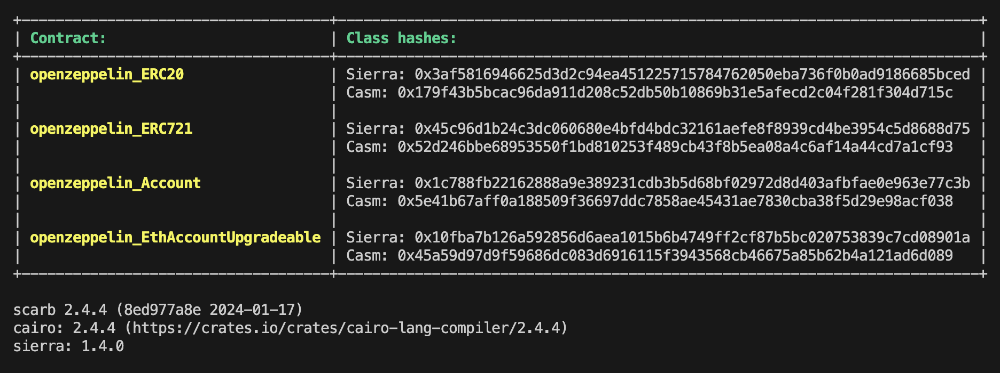

# straknet-class-hash

[](https://crates.io/crates/class-hash)

## Overview

Utility for getting starknet contract's class hashes from Scarb projects.

## Installation

### Cargo

NOTE: The binary crate can't be uploaded to `crates.io` because it has git dependencies, which are not supported by the registry.

* Install the rust toolchain in order to have cargo installed by following
  [this](https://www.rust-lang.org/tools/install) guide.
* Clone the repo and build the executable with `cargo build --release`.
* Move the file `./target/release/class_hash` into a folder within your system path.

## Usage

Run `class_hash get` for generating the class hashes of every contract in your project's scope.

To obtain `sierra` and `casm` class hashes, add the following entries in you `Scarb.toml` manifest file:

```
[lib]

[[target.starknet-contract]]
allowed-libfuncs-list.name = "experimental"
sierra = true
casm = true
```

You should see a similar output in the terminal:



## License

Licensed under the MIT license.
